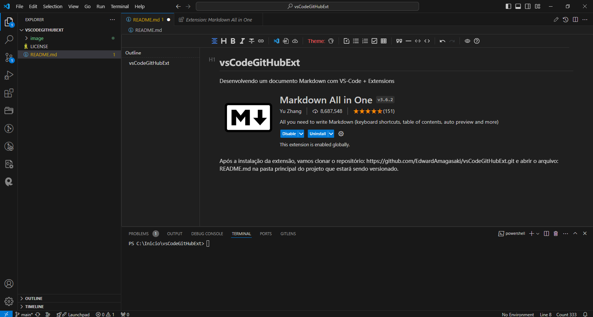

# vsCodeGitHubExt

Desenvolvendo um documento Markdown com VS-Code + Extensions

Após a instalação da extensão, vamos clonar o repositório: https://github.com/EdwardAmagasaki/vsCodeGitHubExt.git e abrir o arquivo: README.md na pasta principal do projeto que estará sendo versionado.

